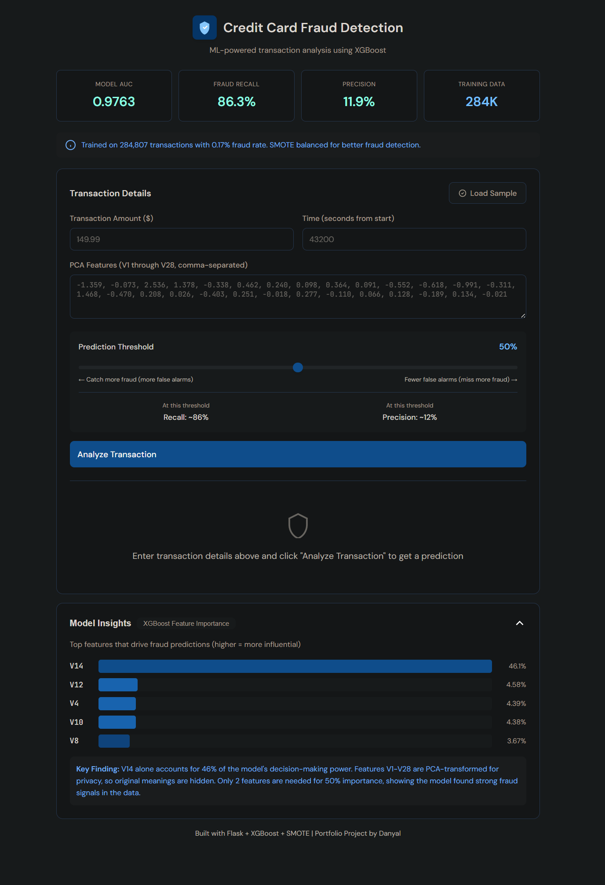
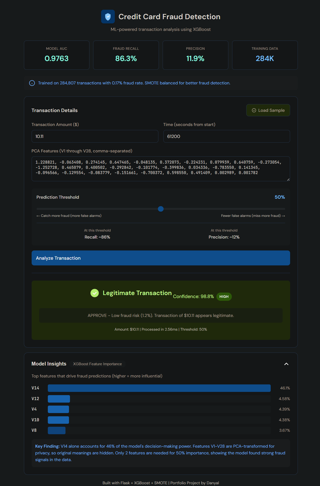
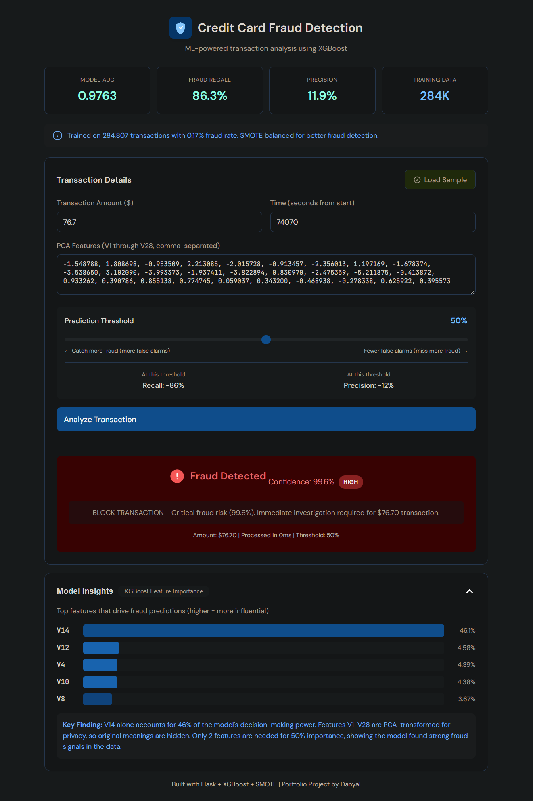

# Credit Card Fraud Detection

An end-to-end machine learning project that detects fraudulent credit card transactions on a severely imbalanced dataset (0.167% fraud rate), compares four model families, quantifies business impact in dollars, and serves the chosen model through a Flask web application for real-time predictions.

**Final deployed model:** XGBoost — Test AUC **0.9763**, Recall **86.3%**, smallest CV-to-test gap (**−0.0033**) across all four models tested.

---

## Demo







The Flask app accepts a 30-feature transaction (Time, Amount, V1–V28), returns a fraud probability, a color-coded risk level, and a business recommendation (Approve / Flag / Hold / Block). An interactive threshold slider lets the user trade recall for precision in real time.

---

## Table of Contents

1. [Problem Statement](#problem-statement)
2. [Dataset](#dataset)
3. [Methodology](#methodology)
4. [Results](#results)
5. [Business Impact](#business-impact)
6. [Web Application](#web-application)
7. [Project Structure](#project-structure)
8. [Installation](#installation)
9. [Usage](#usage)
10. [Key Decisions & Methodology Notes](#key-decisions--methodology-notes)
11. [Visualizations](#visualizations)
12. [Limitations](#limitations)
13. [Future Work](#future-work)
14. [Tech Stack](#tech-stack)
15. [Author](#author)

---

## Problem Statement

Credit card fraud is rare but expensive. In this dataset, fraudulent transactions make up only **0.167%** of all transactions — a class imbalance of roughly **599:1** after cleaning. A naive model that predicts "legitimate" for every transaction would still hit **99.83% accuracy** while catching zero fraud. This makes accuracy useless as a metric and forces three modelling decisions that drive the entire project:

- Resampling is required to give models a learnable signal.
- Evaluation must use **AUC, recall, and precision-recall curves** instead of accuracy.
- Recall is prioritized over precision, because the cost of missing a fraud is much higher than the cost of investigating a false alarm.

## Dataset

| Property | Value |
|---|---|
| Source | [Kaggle: Credit Card Fraud Detection](https://www.kaggle.com/datasets/mlg-ulb/creditcardfraud) |
| Raw transactions | 284,807 |
| After removing 1,081 duplicates | 283,726 |
| Fraud cases (after cleaning) | 473 (0.167%) |
| Features | 30 — `Time`, `Amount`, and `V1`–`V28` (PCA-anonymized for confidentiality) |
| Target | `Class` (0 = legitimate, 1 = fraud) |
| Imbalance ratio | ~599:1 |

The raw CSV is excluded from version control via `.gitignore`. Download it from Kaggle and place it at `data/creditcard.csv` to reproduce the project.

## Methodology

The project follows a standard supervised classification pipeline with strict separation between training and evaluation data.

**1. Exploratory Data Analysis (notebook `01_data_exploration.ipynb`)**
Confirmed zero missing values, surfaced the 599:1 imbalance, and ran statistical tests (Kolmogorov–Smirnov on transaction time, p < 0.0001) to verify that fraud and legitimate transactions occupy statistically distinct distributions. Correlation analysis identified V14, V12, V10, and V16 as the strongest signals.

**2. Preprocessing (notebook `02_data_preparation.ipynb`)**
Removed 1,081 duplicate rows. Applied `StandardScaler` to `Time` and `Amount` only — V1–V28 are already PCA-transformed and don't need scaling. Stratified 80/20 train-test split (226,980 train / 56,746 test) preserving the real-world fraud rate in both sets.

**3. Resampling**
Compared **SMOTE** and **ADASYN** for handling class imbalance. SMOTE consistently produced slightly higher AUC and lower variance across all four model families, so it was selected for the final pipeline. **Critical methodology choice: resampling is applied *inside* each cross-validation fold, never to the test set.** This prevents synthetic samples from leaking into validation and inflating scores.

**4. Modelling (notebook `03_fraud_detection_models.ipynb`)**
Four model families were trained with `GridSearchCV` and 5-fold `StratifiedKFold` cross-validation:

| Model | Why included |
|---|---|
| Logistic Regression | Interpretable linear baseline |
| Random Forest | Tree-based ensemble, robust to outliers |
| XGBoost | Sequential gradient boosting, current industry standard for tabular data |
| Neural Network (PyTorch) | Deep learning comparison, GPU-accelerated |

**5. Evaluation (notebook `04_model_evaluation.ipynb`)**
The held-out test set was touched **once**, in Step 23 of the workflow, after all model selection was complete. Models were compared on test AUC, fraud recall, precision, generalization gap (CV vs test), and business impact in dollars.

**6. Deployment**
The chosen model was wrapped in a Flask app with input validation, a prediction endpoint, a health check, and a model-info endpoint.

## Results

### Cross-validation vs Test Set Performance

| Model | CV AUC | Test AUC | CV→Test Gap |
|---|---|---|---|
| Logistic Regression | 0.9830 | 0.9643 | −0.0187 |
| Neural Network | 0.9803 | 0.9448 | −0.0356 |
| **XGBoost** | **0.9797** | **0.9763** | **−0.0033** |
| Random Forest | 0.9793 | 0.9655 | −0.0138 |

Logistic Regression led on CV. **XGBoost won on the held-out test set** with the smallest generalization gap, meaning its CV estimate was the most honest predictor of real-world performance. This is exactly why test-set isolation matters — without it, we would have shipped Logistic Regression and underperformed in production.

### Fraud Detection at Default 0.5 Threshold (XGBoost)

| Metric | Value |
|---|---|
| True Positives (fraud caught) | 82 / 95 |
| False Negatives (fraud missed) | 13 |
| False Positives (legit flagged) | 607 |
| True Negatives | 56,044 |
| Recall | 86.32% |
| Precision | 11.90% |
| Accuracy | 98.91% (misleading — see below) |
| F1-Score | 0.2092 |

Accuracy is misleading on a 0.167% fraud rate. The model is judged on **recall** (catching fraud) and **average precision** (quality of the ranking).

**Average Precision (AP):** 0.748 — that's **446.6×** better than a random classifier baseline of 0.002.

## Business Impact

A model is only as useful as the dollars it saves. The following analysis assumes a medium-sized US financial institution processing 10 million transactions per month at the observed 0.167% fraud rate. Cost assumptions: $275 average fraud loss, $5 investigation cost per alert.

| Scenario | Annual Loss / Saving |
|---|---|
| No fraud detection (baseline) | −$57,090,000 in fraud losses |
| XGBoost deployed @ 0.5 threshold | +$42,857,940 net annual saving |
| ROI | 668% ($7.70 prevented per $1 investigated) |

**Threshold sensitivity** is documented separately — the model exposes a probability, and the business chooses where to cut. Lower thresholds catch more fraud at the cost of more false alarms; higher thresholds reverse the trade.

## Web Application

The Flask app (`app/app.py`) serves the deployment model through four endpoints:

| Endpoint | Method | Purpose |
|---|---|---|
| `/` | GET | Renders the web interface |
| `/predict` | POST | Returns fraud probability and risk level for one transaction |
| `/health` | GET | Health check for monitoring |
| `/model-info` | GET | Returns model metadata and performance stats |

Frontend (`app/templates/index.html`) is single-page vanilla HTML/CSS/JS — no framework. Features include a transaction input form with V1–V28 textarea, a "Load Sample" button alternating between a real legitimate ($10.11) and a real fraud ($76.70) transaction from the test set, an interactive threshold slider showing live recall/precision estimates, and a collapsible Model Insights panel showing the top 5 feature importances.

Risk levels map directly to business actions:

| Probability | Risk Level | Recommendation |
|---|---|---|
| > 0.8 | Critical | BLOCK TRANSACTION |
| 0.6 – 0.8 | High | HOLD FOR REVIEW |
| 0.4 – 0.6 | Medium | FLAG FOR MONITORING |
| < 0.4 | Low | APPROVE |

## Project Structure

```
credit-card-fraud-detection-project/
├── app/
│   ├── app.py                          # Flask backend
│   ├── templates/
│   │   └── index.html                  # Single-page frontend
│   └── static/css/
├── data/
│   ├── creditcard.csv                  # Raw dataset (excluded from git)
│   └── processed/
│       ├── x_test_scaled.csv
│       └── y_test.csv
├── notebooks/
│   ├── 01_data_exploration.ipynb
│   ├── 02_data_preparation.ipynb
│   ├── 03_fraud_detection_models.ipynb
│   └── 04_model_evaluation.ipynb
├── models/
│   ├── logistic_regression_model.pkl   # Trained models (excluded from git)
│   ├── random_forest_model.pkl
│   ├── xgboost_model.pkl
│   ├── neural_network_model.pth
│   ├── fraud_model_deployment.pkl      # Production XGBoost model
│   ├── deployment_metadata.json
│   ├── cv_comparison_results.csv
│   ├── final_model_comparison.csv
│   ├── fraud_detection_comparison.csv
│   └── feature_importance.csv
├── results/
│   ├── final_test_results.pkl
│   ├── final_results_summary.json
│   ├── business_impact_analysis.json
│   ├── roc_analysis.json
│   ├── pr_analysis.json
│   ├── confusion_matrix_analysis.json
│   └── threshold_analysis.csv
├── images/                             # All visualizations (300 DPI PNG)
├── requirements.txt
├── .gitignore
└── README.md
```

Trained model files (`.pkl`, `.pth`) are excluded from version control because they exceed reasonable repository size. Results, CSVs, JSONs, and visualizations are committed.

## Installation

**Prerequisites:** Anaconda or Miniconda, Python 3.10, Git, and (optional) an NVIDIA GPU with CUDA 12.8 for retraining the neural network.

```bash
# 1. Clone the repository
git clone https://github.com/danyal-a11/credit-card-fraud-detection-project.git
cd credit-card-fraud-detection-project

# 2. Create the conda environment
conda create -n fraud_detection python=3.10
conda activate fraud_detection

# 3. Install dependencies
pip install -r requirements.txt

# 4. Download the dataset from Kaggle
# https://www.kaggle.com/datasets/mlg-ulb/creditcardfraud
# Place creditcard.csv in the data/ folder

# 5. (Optional) Re-train models by running the notebooks in order
# The deployment model (fraud_model_deployment.pkl) is needed to run the app.
# If it's not in models/, run notebook 03 first.
```

## Usage

### Run the web application

```bash
conda activate fraud_detection
python app/app.py
```

Then open `http://127.0.0.1:5000` in a browser. Click **Load Sample** to populate the form with a real test-set transaction, then click **Predict** to see the model's output. The threshold slider lets you trade recall for precision interactively.

**Common gotcha:** if you see `No module named 'xgboost'`, you're running from the wrong conda environment. Activate `fraud_detection` first.

### Reproduce the analysis

Run the Jupyter notebooks in order:

```bash
jupyter notebook
```

1. `01_data_exploration.ipynb` — EDA, statistics, correlation analysis
2. `02_data_preparation.ipynb` — cleaning, scaling, train/test split, SMOTE/ADASYN
3. `03_fraud_detection_models.ipynb` — train and tune all four models
4. `04_model_evaluation.ipynb` — test-set evaluation and visualizations

## Key Decisions & Methodology Notes

This section captures the key design decisions made during the project and the reasoning behind each one.

**Why was the test set held out until the very end?**
Cross-validation gives an estimate of how a model will generalize, but the estimate is only honest if the test set has never influenced any modelling decision — not feature selection, not hyperparameter tuning, not threshold choice. Touching the test set early biases everything that follows. The test set was used exactly once, after model selection was complete.

**Why apply SMOTE inside CV folds rather than to the whole training set?**
Applying SMOTE before splitting into folds means synthetic copies of fraud samples end up in both the training and validation sides of each fold. The model effectively gets to see its validation answers, which inflates CV scores. Resampling inside the fold — fit the oversampler on the training portion only — keeps validation honest.

**Why was XGBoost chosen over Logistic Regression, which led on CV?**
The CV-to-test gap. Logistic Regression scored 0.9830 on CV but dropped to 0.9643 on the test set (a −0.0187 gap). XGBoost scored 0.9797 on CV and 0.9763 on test (a −0.0033 gap). XGBoost's CV estimate was the most accurate predictor of real-world performance, which is exactly what you want for a model going into production.

**Why prioritize recall over precision?**
A missed fraud costs roughly $275 in this scenario. A false positive costs roughly $5 to investigate. The asymmetry means catching more fraud is worth the extra investigation work, up to the point where false positives start to harm customer experience. The threshold slider in the web app lets the business operator dial this trade in real time.

**Why is the model interpretability description honest about V14?**
V14 alone accounts for 46.10% of the model's predictive power. The PCA transformation hides what V14 actually represents in real-world banking features, so we can't say "the model relies heavily on cardholder location" or anything similarly concrete. The README and the app both flag this limitation — production deployment of an interpretable system would require SHAP-style per-prediction explanations and access to the original (non-PCA) features.

**Why feature importance only for XGBoost?**
XGBoost's feature importance is meaningful because gradient-boosted trees expose how often each feature is used and how much each split improves the loss. Random Forest's "importance" is computed similarly but the model itself is harder to inspect prediction by prediction. Logistic Regression has interpretable coefficients (a different kind of importance) and Neural Networks have neither. Mixing these into one chart would be misleading.

## Visualizations

All 300 DPI PNG plots live in `images/`. The most informative ones:

| File | What it shows |
|---|---|
| `fraud_distribution.png` | 599:1 class imbalance visualised |
| `amount_distribution.png` | Fraud vs legitimate transaction amounts |
| `time_distribution.png` | Temporal distribution with K-S test result |
| `feature_correlations.png` | Top 15 features by correlation with `Class` |
| `model_comparison_cv_test.png` | CV vs test AUC for all four models + generalization gaps |
| `nn_training_history.png` | Neural network loss and validation AUC across epochs |
| `final_test_roc_curve.png` | XGBoost ROC curve with optimal operating point |
| `roc_curve.png` | XGBoost ROC with Youden's-J operating point and FPR-constrained options |
| `precision_recall_curve.png` | PR curve — the primary metric for imbalanced data |
| `feature_importance_top10.png` | Top 10 features by XGBoost importance |
| `feature_importance_cumulative.png` | Cumulative importance showing only 2 features capture 50% |
| `confusion_matrix.png` | XGBoost confusion matrix at 0.5 threshold |
| `confusion_matrix_business.png` | Same matrix relabelled in business terms |
| `threshold_analysis.png` | Four-panel sweep showing precision, recall, F1, and net value across thresholds |

## Limitations

- **PCA-anonymized features.** V1–V28 cannot be mapped back to original banking features, so feature importance shows *which* signals matter but not *why*. A real production deployment would require access to the source features and SHAP-based per-prediction explanations.
- **Business cost assumptions are illustrative and vary by analysis.** The executive-level business impact analysis uses $275 average fraud and $5 investigation cost. The threshold sensitivity analysis uses a more conservative 1:6 ratio ($25 false positive / $150 false negative) to illustrate how threshold choice shifts net value. Real institutions would calibrate against their own cost structure — published ratios typically range from 1:20 to 1:50.
- **Two days of data.** The dataset covers a 48-hour window from European cardholders in 2013. Temporal generalization to longer time spans or different geographies is not validated here.
- **Test-set fraud count is small.** 95 fraud cases in the test set means precision and recall estimates have wide confidence intervals. This is unavoidable given the dataset, but should be acknowledged.
- **The web app is local-only.** It runs on `127.0.0.1:5000` with Flask's development server. Production deployment would need a WSGI server (Gunicorn), HTTPS, authentication, request logging, and a proper monitoring stack.

## Future Work

- Add SHAP explanations to the web app so each prediction comes with a per-feature contribution breakdown.
- Deploy to a cloud platform (Render, Railway, or AWS) with HTTPS and request logging.
- Build a monitoring dashboard tracking prediction drift, false positive rate over time, and model performance on fresh data.
- Experiment with cost-sensitive learning (class weights tuned to the dollar asymmetry) as an alternative to SMOTE.
- Test on a larger, more recent fraud dataset to validate temporal generalization.

## Tech Stack

**Languages & libraries:** Python 3.10, pandas, NumPy, scikit-learn, imbalanced-learn, XGBoost, PyTorch 2.9.1 (CUDA 12.8), Flask, matplotlib, seaborn, SciPy

**Environment:** conda, Jupyter, VS Code

**Version control:** Git, GitHub

**Hardware used for training:** Ryzen 7 9700X (8C/16T), RTX 5070 Ti (16GB VRAM), 32GB DDR5

## Author

**Danyal**
- GitHub: [danyal-a11](https://github.com/danyal-a11)
- LinkedIn: www.linkedin.com/in/danyal-a1i
- Email: danyal.1@hotmail.com

## License

This project is released under the MIT License. See `LICENSE` for details.